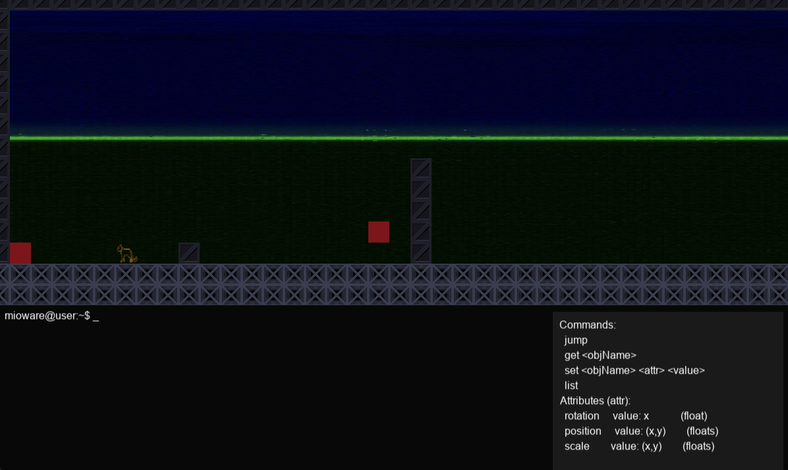
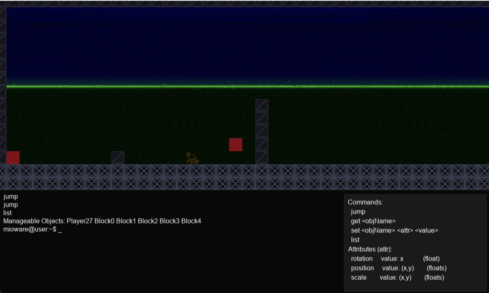
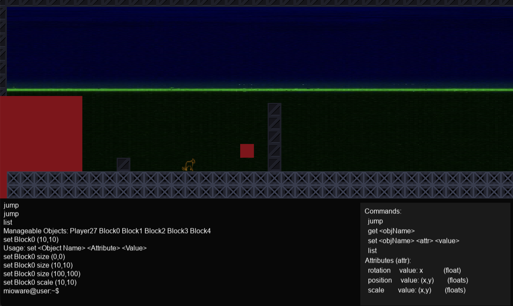
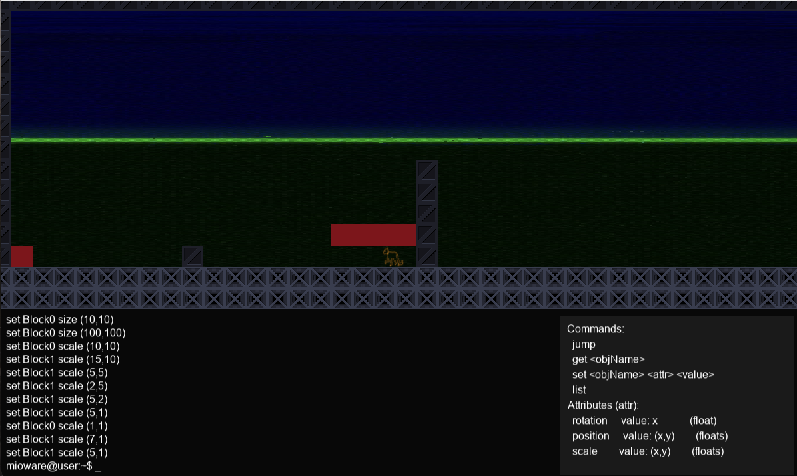

**Screenshots**

- Início da fase: 
- Primeiros comandos no terminal: 
- Alterar tamanho de bloco: 
- Alterar bloco e mover para frente: 

**Título**

Miaoware

**Descrição**

Miaoware é um jogo de plataforma 2D onde o jogador controla um gato que percorre fases cheias de blocos móveis, inimigos e itens coletáveis. O objetivo principal é atravessar o nível até o ponto de chegada, evitando inimigos e armadilhas enquanto coleta itens que podem aumentar o tamanho do personagem ou conceder habilidades temporárias.

O jogador possui controles simples: andar (esquerda/direita), pular e interagir com o terminal embutido para comandos de depuração (por exemplo, `jump`). Mecânicas adicionais incluem blocos móveis, spawners de inimigos, e power-ups (como cogumelos) que alteram a colisão e animações do personagem.

Condições de vitória: completar o nível atual (atingir o objetivo da fase) ou completar todas as fases designadas em uma sessão de playtest. Condições de derrota: morrer por colisão com inimigo sem ter power-up, cair fora dos limites do mapa ou perder todas as vidas (se implementado). Ao morrer, efeitos sonoros e transições visuais ocorrem e o jogador pode reiniciar a fase.

**Funcionalidades a serem testadas**

- Menu principal: ver se música de fundo (`Assets/Sounds/MainMenu/Jazz.mp3`) toca corretamente e se iniciar/quit funcionam.
- Música de nível: verificar que `Assets/Sounds/Levels/BackgroundMusic.wav` toca em loop ao iniciar o jogo e só para ao morrer ou sair.
- Efeitos sonoros: confirmar SFX de pulo (`Assets/Sounds/Cat/Jump.wav`), passo (`Assets/Sounds/Cat/Walking.wav`) em loop enquanto anda no chão, e grito de morte (`Assets/Sounds/MainMenu/Screaming.wav`).
- Animações do personagem: checar `idle`, `jump` (8 frames) e `run` (walking frames) estão corretas e com FPS apropriado.
- Terminal: testar comandos como `jump`, `get`, `set` e `list` e observar que o terminal só aparece durante a gameplay (ESC não abre terminal no menu).
- Colisões: testar colisões horizontais e verticais com inimigos, blocos e power-ups (verificar se `EnemyHit`, `OnHorizontalCollision` e `OnVerticalCollision` acionam corretamente as respostas).
- Persistência de áudio: confirmar que parar/pausar um SFX específico não interrompe outras trilhas (por exemplo, parar walking não deve parar a música de fundo do nível).

**Créditos**

Este repositório contém o trabalho do grupo. Atualize os nomes e atribuições abaixo com os membros reais do grupo.

- Lucas Rocha Laredo — Menu Principal, animações, sistema de áudio (AudioSystem)
- Hector Julio Pardinho Soares — Terminal, implementação do level design e sistema de colisões
- Mirna Mendonça — Assets, Level Design, Sprites
- Ricardo Dias Avelar — Diálogo, componentes, mecânicas usadas pelo terminal
- Victor Prates Figueiredo — Correção de bugs (Terminal e mecanicas)

Todos os membros foram adicionados como colaboradores no repositório GitHub.
